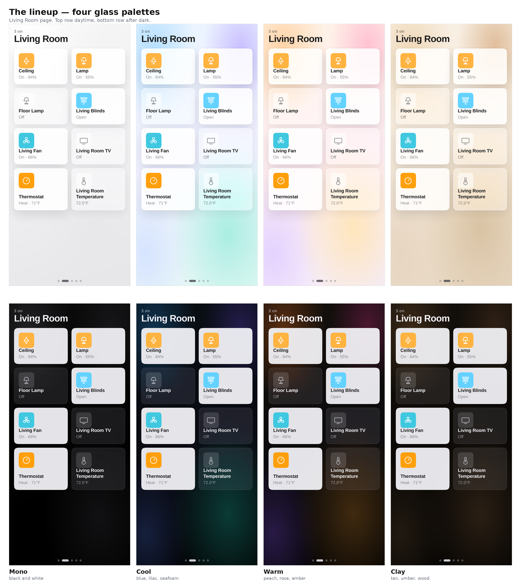

# ProjectMikey Dashboard

A single self-contained Lovelace card that renders a whole smart-home dashboard:
swipeable room pages, frosted-glass tiles, hand-drawn icons, four palettes.

No dependencies. No build step. One file, one Lovelace resource.



---

## What it is

`pm-home` is one custom card. You give it a list of pages, each page a list of
entity IDs, and it does the rest — picks the icon, the accent colour and the
status line from the entity's domain and device class.

- **Pages swipe** using CSS scroll-snap, so the browser's own momentum does the
  animation. There is no JavaScript gesture handler anywhere in the card.
- **State reads as inversion.** An off tile is a translucent pane; an on tile
  flips to opaque with the icon chip in the entity's accent colour. You can see
  what's on from across a room without reading anything.
- **Tap toggles. Press and hold** (480 ms) opens Home Assistant's own more-info
  dialog, so brightness, colour, setpoints and history come from the platform.
- **One stylesheet, no breakpoint guessing.** Tile height, icon size and padding
  are fluid `clamp()` values against a centred 1180 px measure, so a phone, an
  iPad and a wall display all get the same layout at the right scale.
- **Light and dark** follow the sun, the device, or a fixed choice — see below.

## Install (HACS)

1. HACS → three-dot menu → **Custom repositories**
2. URL: `https://github.com/<you>/projectmikey-dashboard`, Type: **Dashboard**
3. Find **ProjectMikey Dashboard** in the list → **Download**
4. HACS registers `/hacsfiles/projectmikey-dashboard/pm-home.js` for you.

Private repo? HACS needs a GitHub token with `repo` scope — it will have asked
for one when you set HACS up. If the repo doesn't appear, that token is the
thing to check.

Full walkthrough, including the manual path: [docs/INSTALL.md](docs/INSTALL.md)

## Card options

```yaml
type: custom:pm-home
palette: glass-cool      # see docs/PALETTES.md
theme: sun               # sun | light | dark | (omit = follow the device)
pages:
  - name: Home
    sections:
      - title: Scenes
        items: [scene.good_morning, scene.movie_night]
      - title: Favourites
        items: [light.ceiling, lock.front_door, climate.thermostat]
  - name: Living Room
    sections:
      - items: [light.ceiling, light.lamp, cover.living_blinds, fan.living_fan]
      - title: Sensors
        items: [sensor.living_room_temperature]
```

| Key | Values | Default |
|---|---|---|
| `pages` | list of `{name, sections[]}` | **required** |
| `palette` | `glass-mono` `glass-cool` `glass-warm` `glass-clay`, or a flat one | built-in |
| `theme` | `sun`, `light`, `dark`, omit to follow the device | follow device |

### On `theme: sun`

Reads Home Assistant's own `sun.sun` entity: light while the sun is up, dark
after it sets. **Prefer this on customer installs.** Following the device means
one person's phone set to permanent Dark makes their dashboard look different
from the wall tablet in the same room. The sun is one answer for the whole
house, and it matches what people expect. Falls back to light if `sun.sun`
doesn't exist.

## Supported entities

Lights, switches, covers, fans, locks, climate, media players, scenes, binary
sensors and sensors. Anything else gets a neutral tile and a plain state string.

## Repo layout

```
dist/pm-home.js        the card — the only file HACS installs
packages/showroom.yaml optional demo entity set (see docs/SHOWROOM.md)
tools/new-install.js   builds the dashboards on a fresh box
docs/                  install, palettes, showroom, per-customer checklist
```

## Releases

HACS prefers tagged releases. After pushing a change:

```bash
git tag v1.1.0 && git push --tags
```

then draft a release from that tag on GitHub. Every install that has the repo
added will offer the update.
